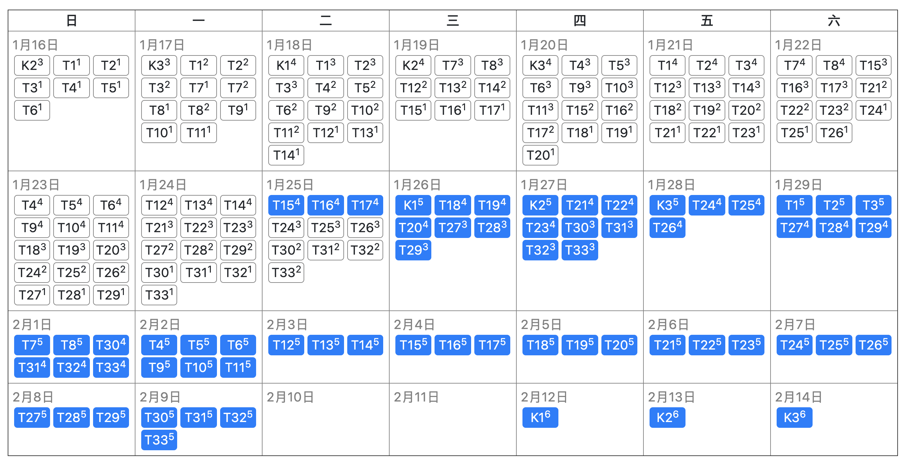
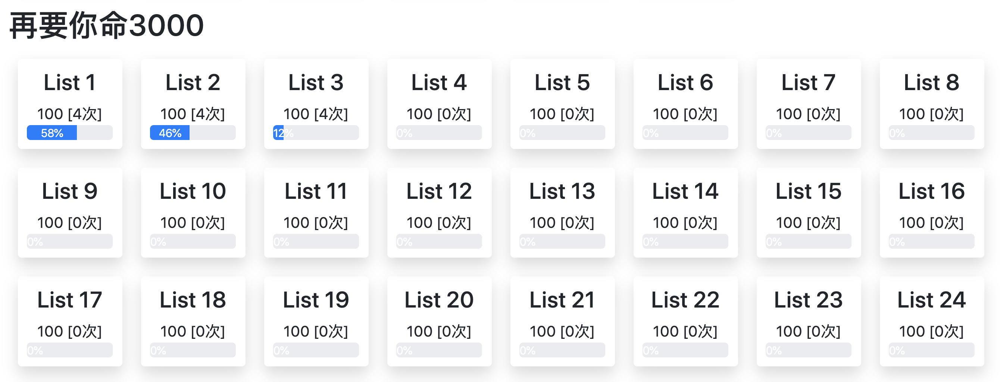

<a href="https://benature.github.io/"></a>

# Word Review 单词复习


Django + MySQL + Pug + JS

- Python 3.7+
- Django 3
- Mysql 8

简单录了一个 DEMO 视频，上传到了[B站](https://www.bilibili.com/video/av90579311/)，欢迎康康。

如果觉得还不错的话，不如给个 stars🌟呗(￣▽￣)~*

## 前言

<b><details><summary>前言有点啰嗦（先收起来）</summary></b>

### 主流单词软件给我的痛点

大部分软件对错词的处理似乎只记录了他`错过`，至于错了多少次，用户一般不能显式知晓。对单词错误率的感觉，只能从这个单词是否在软件的错题本上显式来隐隐约约得知。之前看过一些背单词的方法，其中一个是根据错误率排序来背单词（也就算是挑重点了），这样我觉得比单纯一个错题本记录要来的精确。

<!-- 后面讲讲自己多记录一些数据能带来些什么新的感觉 -->

*当然，我没做过什么市场调查，只是一路上在背单词摸爬滚打的一些感觉，有可能只是因为我走了弯路没找到心水的。* 🤦‍♂️ *~~反正做都做了，自己做的肯定是香的。而且自己抓着背单词情况的数据也有种心理满足的错觉吧~~*

### 我觉得我多了些什么

- 单词复习历史曲线
  有些单词同样背了 5 次，比如 abandon 只是第一次不认得后面都记得了，又有个 anarchy 一开始印象深结果第五次复习时候不记得了，两者的记忆率都是 4/5=80%，但是我在第六次复习的时候显然对这两个单词的重视程度是不一样的。  
  又比如有些单词的记忆情况是起伏波动的——“记得-忘了-记得-忘了···”，那我复习这些单词的时候就会注意是什么造成了我对他的印象忽明忽暗的了。
- 每一轮复习的记忆曲线
  有时候精神不集中，看到一个单词没多想就觉得忘了，点了不认识，然后这一轮的复习曲线就持续走低，看到”本轮复习分数“下滑肯定不好受啦，后面的单词就多努力回忆一下了，也算是一种激励吧。
  
<!-- - 记忆法 -->

### 我还缺什么

- 缺单词库啊，还用说吗！  
  不过网络这么发达，我要的单词书基本都能找到电子清单(๑•̀ㅂ•́)و✧
<!-- - 有些人可能会说缺了图，像百次斩那种 -->
- ~~缺背单词的毅力~~
- ······

</details>

</br>

<p align="center">单词复习页</p>
<p align="center">
  <a href="https://www.bilibili.com/video/av90579311/"></a>
</p>
</br>
<p align="center">艾宾浩斯日历(略丑求不喷)</p>
<p align="center">
  <a href="https://www.bilibili.com/video/av90579311/"></a>
</p>
</br>
<p align="center">主页</p>
<p align="center">
  <a href="https://www.bilibili.com/video/av90579311/"></a>
</p>
<p align="center">（蓝条是历史记忆率，绿条是上一轮的记忆率）</p>
</br>

背单词方法我主要参考[这种方法](https://www.bilibili.com/video/av46223252/)，也是这个项目的想法源起。

## 安装

```shell
git clone https://github.com/Benature/WordReview.git
```

复制一份`./config_sample.py`文件，改名为`./config.py`

其余安装指引请看[这里](doc/install.md)，数据库初始化看[这里](doc/database_init.md)。

文档尚不完善，如有问题欢迎[提 issue](https://github.com/Benature/WordReview/issues) 或者私戳我 (●ﾟωﾟ●)

>如果你实在不想折腾配置的话，可以在[这里](https://github.com/Benature/WordReview/releases)直接安装可执行文件。（不推荐）

<!-- 链接:https://pan.baidu.com/s/1XiyI7DPxrd_mRsuvMeJwQg  密码:0hhe -->

## 使用

```shell
conda activate <venvName> # 小白流程不用这条命令
python manage.py runserver
```

打开[localhost:8000](localhost:8000/)，开始背单词之旅吧 🤓

当你想要更新代码的时候，请

```shell
git pull
python manage.py makemigrations
python manage.py migrate
```

### 快捷键

|          操作          |          快捷键          |   页面   |   状态   |
| :--------------------: | :----------------------: | :------: | :------: |
|       设为重难词       |       `Shift + H`        | 复习页面 |   全局   |
|       设为太简单       |       `Shift + E`        | 复习页面 |   全局   |
|     进入笔记输入框     |           `N`            | 复习页面 |   全局   |
| 查看助记法（记忆之沙） |        `T` / `V`         | 复习页面 |   全局   |
|      词卡前后切换      |         `<`、`>`         | 复习页面 |   全局   |
|      List前后切换      | `Shift + <`、`Shift + >` | 复习页面 | 学习状态 |
|        查看释义        |          `空格`          | 复习页面 | 复习状态 |
|     切换至学习状态     |           `P`            | 复习页面 | 复习状态 |
|      触发重现模式      |           `R`            | 复习页面 | 复习状态 |
|         我记得         |       `Shift + →`        | 复习页面 | 复习状态 |
|         不认识         |       `Shift + ←`        | 复习页面 | 复习状态 |
|     跳转到日历页面     |           `C`            |   主页   |    -     |

### 词根词缀词源拆词渲染

eg: 以`detain`为例

```
de=down
tain
```

---

[TODO 清单](https://www.notion.so/benature/WordReview-fa7e264c1e2048639586af4eb952374f)（有点杂乱）

### 更新日志

- 2020.04
  - feature: Chrome Extension 谷歌浏览器插件：记忆之沙助记法显示 @04-12
  - update:  错不过三：不认识三次后强制不再背该词 @04-11
  - update:  无论状态，错一次后需重背一次该词 @04-11
  - feature: 例句支持关键词高亮 @04-11
  - update:  未显示释义不能选择是否认识 @04-11
  - update:  优化复习页面布局 @04-10
  - feature: 新增`助记法`与`音标`字段 @04-10
  - feature: 新增预习(学习状态) @04-08
  - update:  优化获取单词键值对处理 @04-08
  - feature: 新增 [WebsterVocabularyBuilder](https://www.zhihu.com/question/27538740) 是否收录字段 @04-08
  - fix:     日历页面任务过期太久引发页面渲染失败 @04-05
  - update:  `note` 光标离焦后自动更新，不必点击`我记得`或`不认识` @04-05
  - feature: 主页显示近期记忆率 @04-05
  - feature: 词根词缀词源拆词渲染 @04-05
  - feature: `太简单`与`重难词`标记 @04-05
  - feature: 离开`review`页面前询问（防止手误离开页面） @04-02
  - feature: 增加 **例句** 显示 @04-02
  - update:  单个单词进度条改为左记右忘 @04-01
  - feature: 词表初始化排序设置支持叠加排序 @04-01
- 2020.03
  - update:  增加添加笔记快捷键`N` @03-24
  - update:  重现模式在 `背词数目==已背单词+50` 后自动关闭一次（防止无脑过词） @03-24
  - update:  增加重现模式快捷键`R` @03-18
  - update:  `note` 输入框无视快捷键 @03-18
  - update:  重现模式在背词数目超过词表长度 50 次后自动关闭一次（防止无脑过词） @03-17
  - update:  历史曲线 X 轴 label 从数字改为单词 @03-01
- 2020.02
  - feature: 背单词的重现模式([pr#1](https://github.com/Benature/WordReview/pull/1)) @02-29
  - release: 打包可执行文件 @02-28
  - feature: 新增导入单词本页面 @02-27
  - feature: 笔记框默认隐藏，点击显示（增加有无笔记之对比） @02-27
  - update:  优化线型图显示（0 起） @02-27
  - fix:     日历显示月份 bug 修复 @02-27
  - more:    略······
