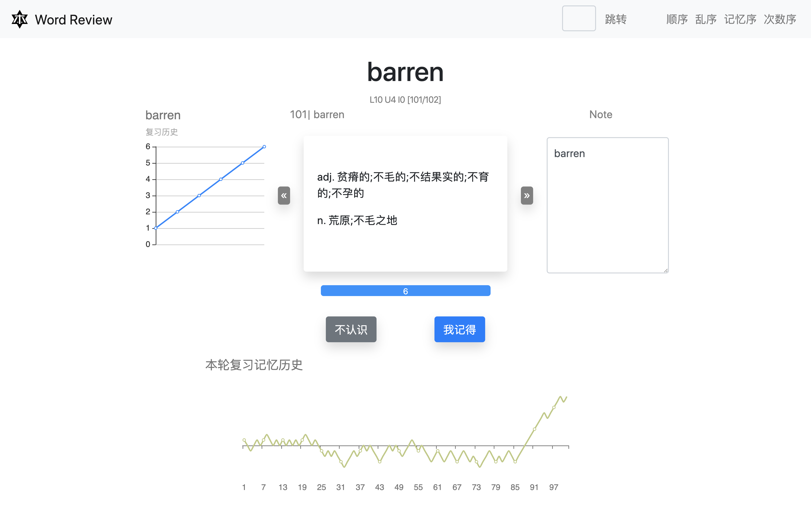

<a href="https://benature.github.io/"></a>

# Word Review 单词复习

Django + MySQL + Pug + JS

- Python 3.7+
- Django 3
- Mysql 8

简单录了一个 DEMO 视频，上传到了[B站](https://www.bilibili.com/video/av90579311/)，欢迎康康。

如果觉得还不错的话，不如给个 star✨呗(￣▽￣)~*

## 前言

<b><details><summary>前言有点啰嗦（先收起来）</summary></b>

### 主流单词软件给我的痛点

大部分软件对错词的处理似乎只记录了他`错过`，至于错了多少次，用户一般不能显式知晓。对单词错误率的感觉，只能从这个单词是否在软件的错题本上显式来隐隐约约得知。之前看过一些背单词的方法，其中一个是根据错误率排序来背单词（也就算是挑重点了），这样我觉得比单纯一个错题本记录要来的精确。

<!-- 后面讲讲自己多记录一些数据能带来些什么新的感觉 -->

*当然，我没做过什么市场调查，只是一路上在背单词摸爬滚打的一些感觉，有可能只是因为我走了弯路没找到心水的。* 🤦‍♂️ *~~反正做都做了，自己做的肯定是香的。而且自己抓着背单词情况的数据也有种心理满足的错觉吧~~*

### 我觉得我多了些什么

- 单词复习历史曲线
  有些单词同样背了 5 次，比如 abandon 只是第一次不认得后面都记得了，又有个 anarchy 一开始印象深结果第五次复习时候不记得了，两者的记忆率都是 4/5=80%，但是我在第六次复习的时候显然对这两个单词的重视程度是不一样的。  
  又比如有些单词的记忆情况是起伏波动的——“记得-忘了-记得-忘了···”，那我复习这些单词的时候就会注意是什么造成了我对他的印象忽明忽暗的了。
- 每一轮复习的记忆曲线
  有时候精神不集中，看到一个单词没多想就觉得忘了，点了不认识，然后这一轮的复习曲线就持续走低，看到”本轮复习分数“下滑肯定不好受啦，后面的单词就多努力回忆一下了，也算是一种激励吧。
  
<!-- - 记忆法 -->

### 我还缺什么

- 缺单词库啊，还用说吗！  
  不过网络这么发达，我要的单词书基本都能找到电子清单(๑•̀ㅂ•́)و✧
<!-- - 有些人可能会说缺了图，像百次斩那种 -->
- ~~缺背单词的毅力~~
- ······

</details>

</br>

<p align="center">单词复习页</p>
<p align="center">
  
</p>
</br>

背单词方法我主要参考[这种方法](https://www.bilibili.com/video/av46223252/)。

## 安装

```shell
git clone https://github.com/Benature/WordReview.git
```

复制一份`./config_sample.py`文件，改名为`./config.py`

安装指引请看[这里](doc/install.md)，数据库初始化看[这里](doc/database_init.md)。

文档尚不完善，如有问题欢迎[提 issue](https://github.com/Benature/WordReview/issues) 或者私戳我 (●ﾟωﾟ●)

## 使用

```shell
conda activate <venvName> # <venvName>是你设置的虚拟环境名
python manage.py runserver
```

打开[localhost:8000](localhost:8000/)，开始背单词之旅吧 🤓

当你想要更新代码的时候，请

```shell
git pull
```
