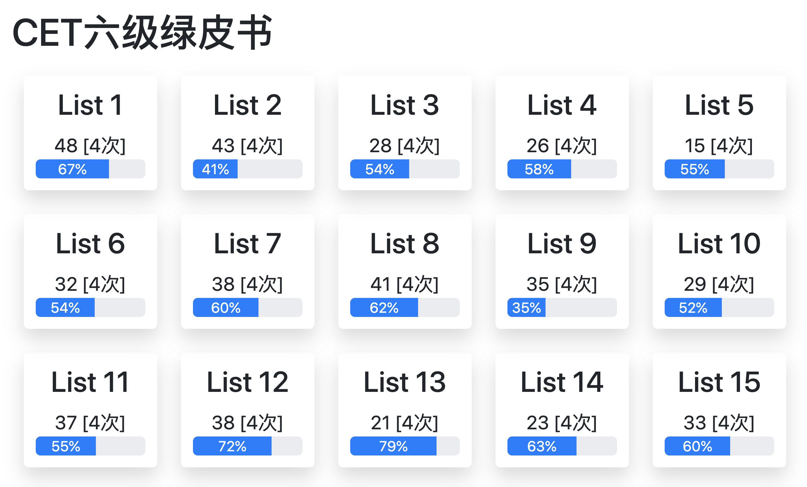

<a href="https://benature.github.io/WordReview/"></a>

# Word Review 单词复习


Django + MySQL + Pug + JS

- Python 3.7+
- Django 3
- Mysql 8 / sqlite 3

二月的时候简单录了一个 DEMO 视频，上传到了[微信公众号](https://mp.weixin.qq.com/s/3VjiflLdzKv0sjxm1noxDw)和[B站](https://www.bilibili.com/video/av90579311/)（BV 号：**BV1q7411w7r9**），欢迎康康。

还有一个[在线试玩](https://benature.github.io/WordReview/)，可以先感受一下。
>在线体验的版本对应`master`分支，现在默认显示的是`ben`分支（开发分支）

如果觉得还不错的话，不如给个 stars🌟呗(￣▽￣)~*

[前言](#前言)  
[安装指引](#安装)  
[使用说明](#使用)  
[更新日志](#更新日志)  

## 前言

此项目主要是将`Excel背单词`方法给 App 化，更符合用户操作习惯。  
第一次听说`Excel背单词`这个方法是看了[红专学姐](https://www.zhihu.com/people/you-hong-you-zhuan-ai-dang-wu-si-qing-nian)的[文章](https://zhuanlan.zhihu.com/p/100104481)，后来在[B站](https://www.bilibili.com/video/av46223252/)看到了更详细的讲解，几天后这个项目便诞生了。

功能特性太多，写在这就太长了，新开一页写[特性说明](https://www.notion.so/benature/Word-Review-0f56c8a9131b4ae3b6d9a6fda5c4e655)。

第一篇介绍推送[在此](https://mp.weixin.qq.com/s/zOmpevAUafFY5kPGYr65uA)（微信公众号：恰好恰好）。

</br>

<p align="center">单词复习页</p>
<p align="center">
  <a href="https://www.bilibili.com/video/av90579311/"></a>
</p>
</br>
<p align="center">艾宾浩斯日历 & 主页</p>
<p align="center">
  <a href="https://www.bilibili.com/video/av90579311/"></a>
  <a href="https://www.bilibili.com/video/av90579311/"></a>
</p>
</br>

*蓝条是历史记忆率，绿条是上一轮的记忆率*  
*关于两种进度条的具体解释见[此处](#list-%E7%9A%84%E8%AE%B0%E5%BF%86%E7%8E%87)*

</br>


## 安装

>对于小白可能还需要一些预备说明，请看[这里(更新中)](https://www.notion.so/benature/Word-Review-0b73633ff0c14488a99d33d144c26423)

命令行输入

```shell
git clone https://github.com/Benature/WordReview.git
```

或者点击右上角的`Clone or Download`的绿色按钮。

详细的安装指引写的有点长，请点击[这里](doc/install.md)查看，数据库初始化看[这里](doc/database_init.md)。

如有问题欢迎[提 issue](https://github.com/Benature/WordReview/issues) 或者 email(<wbenedict@163.com>) 或者私戳我 (●ﾟωﾟ●)

>如果你实在不想折腾配置的话，可以在[这里](https://github.com/Benature/WordReview/releases)直接安装可执行文件。（不推荐）

<!-- 链接:https://pan.baidu.com/s/1XiyI7DPxrd_mRsuvMeJwQg  密码:0hhe -->

## 使用

```shell
conda activate <venvName> # 小白流程不用这条命令
python manage.py runserver
```

默认情况下会自动在默认浏览器打开<localhost:8000/>，开始背单词之旅吧 🤓
>如果您没有修改过配置但不能自动打开浏览器，请[提交 issue 反馈](https://github.com/Benature/WordReview/issues)。

当您想要更新代码的时候，请

```shell
git pull
python manage.py makemigrations
python manage.py migrate
```

### 快捷键

|          操作          |          快捷键          |   页面   |      状态      |
| :--------------------: | :----------------------: | :------: | :------------: |
|       设为重难词       |    `Shift + H` (Hard)    | 复习页面 |      全局      |
|       设为已掌握       |    `Shift + G` (Get)     | 复习页面 |      全局      |
|       设为太简单       |    `Shift + E` (Easy)    | 复习页面 |      全局      |
|     进入笔记输入框     |        `N` (Note)        | 复习页面 |      全局      |
| 查看助记法（记忆之沙） | `T` (Tips) / `V` (View)  | 复习页面 |      全局      |
|      词卡前后切换      |         `<`、`>`         | 复习页面 |      全局      |
|      List前后切换      | `Shift + <`、`Shift + >` | 复习页面 |    学习状态    |
|        查看释义        |          `空格`          | 复习页面 |    复习状态    |
|     切换至学习状态     |      `P` (Preview)       | 复习页面 |    复习状态    |
|      触发重现模式      |       `R` (Repeat)       | 复习页面 |    复习状态    |
|         我记得         |       `Shift + →`        | 复习页面 |    复习状态    |
|         不认识         |       `Shift + ←`        | 复习页面 |    复习状态    |
|  复制`WordSand`助记法  |        `C` (Copy)        | 复习页面 | 安装Chrome插件 |
|     跳转到日历页面     |      `C` (Calendar)      |   主页   |       -        |

### 词根词缀词源拆词渲染

eg: 以`detain`为例，其中等号`=`是标记符号。

```
de=down
tain
```

### List 的记忆率

- 蓝条：历史记忆率，对 List 内单词的总记忆率取平均
- 绿条：上轮记忆率，按 List 内单词的 **最新两次** 记忆情况计算平均记忆率

### 单词的`flag`

- 太简单：✅打钩，下次背词不再出现，统计记忆率时视为 `1`
- 已掌握：🟢绿灯，下次背词仍然出现，统计记忆率时视为 `1`
- 重难词：⭐️标星

---

[TODO 清单](https://www.notion.so/benature/WordReview-fa7e264c1e2048639586af4eb952374f)（有点杂乱）

### 更新日志

- 2020.04
  - release: version 0.2.0 @04-19
  - update:  导航栏样式增加激活状态(`.enabled`) @04-18
  - update:  配置文件更换为`.conf`文件（以支持默认参数） @04-18
  - feature: 命令行启动后自动打开浏览器 ([Issue#4](https://github.com/Benature/WordReview/issues/4)) @04-16
  - feature: 新增[在线预览](https://benature.github.io/WordReview/) @04-16
  - feature: 对<http://dict.cn/mini.php>的后端爬虫 API ([Issue#2](https://github.com/Benature/WordReview/issues/2)) @04-15
  - update:  Note 区高度自适应 @04-13
  - update:  修改 Note 区显示渲染逻辑 @04-13
  - feature: 对记忆之沙内容进行快捷键复制 @04-13
  - feature: 单词的`flag`新增`已掌握` @04-13
  - feature: Chrome Extension 谷歌浏览器插件：记忆之沙助记法显示 @04-12
  - update:  错不过三：不认识三次后强制不再背该词 @04-11
  - update:  无论状态，错一次后需重背一次该词 @04-11
  - feature: 例句支持关键词高亮 @04-11
  - update:  未显示释义不能选择是否认识 @04-11
  - update:  优化复习页面布局 @04-10
  - feature: 新增`助记法`与`音标`字段 @04-10
  - feature: 新增预习(学习状态) @04-08
  - update:  优化获取单词键值对处理 @04-08
  - feature: 新增 [WebsterVocabularyBuilder](https://www.zhihu.com/question/27538740) 是否收录字段 @04-08
  - fix:     日历页面任务过期太久引发页面渲染失败 @04-05
  - update:  `note` 光标离焦后自动更新，不必点击`我记得`或`不认识` @04-05
  - feature: 主页显示近期记忆率 @04-05
  - feature: 词根词缀词源拆词渲染 @04-05
  - feature: `太简单`与`重难词`标记 @04-05
  - feature: 离开`review`页面前询问（防止手误离开页面） @04-02
  - feature: 增加 **例句** 显示 @04-02
  - update:  单个单词进度条改为左记右忘 @04-01
  - feature: 词表初始化排序设置支持叠加排序 @04-01
- 2020.03
  - update:  增加添加笔记快捷键`N` @03-24
  - update:  重现模式在 `背词数目==已背单词+50` 后自动关闭一次（防止无脑过词） @03-24
  - update:  增加重现模式快捷键`R` @03-18
  - update:  `note` 输入框无视快捷键 @03-18
  - update:  重现模式在背词数目超过词表长度 50 次后自动关闭一次（防止无脑过词） @03-17
  - update:  历史曲线 X 轴 label 从数字改为单词 @03-01
- 2020.02
  - feature: 背单词的重现模式 ([PR#1](https://github.com/Benature/WordReview/pull/1)) @02-29
  - release: 打包可执行文件 @02-28
  - feature: 新增导入单词本页面 @02-27
  - feature: 笔记框默认隐藏，点击显示（增加有无笔记之对比） @02-27
  - update:  优化线型图显示（0 起） @02-27
  - fix:     日历显示月份 bug 修复 @02-27
  - more:    略······
